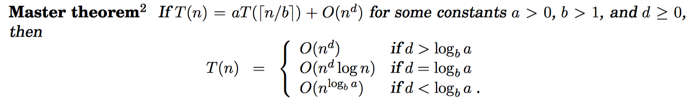
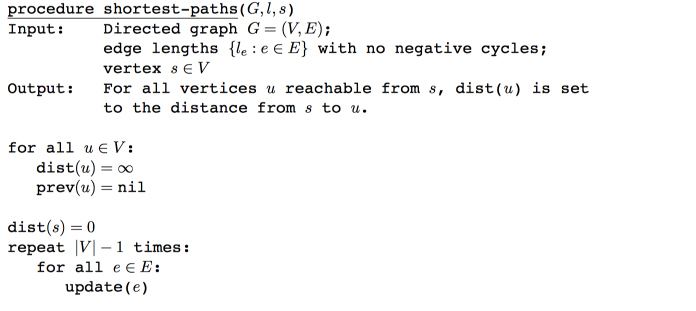

## Brute-force algorithm
Brute-force search or exhaustive search, also known as generate and test, is a very general problem-solving technique that consists of systematically enumerating all possible candidates for the solution and checking whether each candidate satisfies the problem's statement.

<br />

---

## Big O theta & big-omega
$f(x) = O(g(x))$ (big-oh)
means that the growth rate of f(x) is asymptotically _**less than or equal**_ to to the growth rate of $g(x)$

$f(x) = Ω(g(x))$ (big-omega)
means that the growth rate of f(x) is asymptotically _**greater than or equal**_ to the growth rate of $g(x)$

$f(x) = Θ(g(x))$ (theta)
means that the growth rate of f(x) is asymptotically _**equal**_ to the growth rate of $g(x)$

<br />

---

## heap (data structure)
A heap can be classified further as either a "max heap" or a "min heap". In a **max heap**, the keys of parent nodes are always greater than or equal to those of the children and the highest key is in the root node.
 

<br />

---

## Matrix

### adjacency matrix
Space Complexity: $Θ(V^2)$
an adjacency matrix is a square matrix used to represent a finite graph. The elements of the matrix indicate whether **pairs of vertices are adjacent or not** in the graph.


<br />

### incidence matrix
Space Complexity: $Θ(V*E)$
an incidence matrix is a matrix that shows the relationship between two classes of objects.
 
<br />

---


## Recurrence relations
$a$ subproblems of size $n/b$ and then combining these answers in $O(n^d)$ time, for some $a,b,d > 0$ (in the multiplication algorithm, $a = 3$, $b = 2$, and $d = 1$). Their running time can therefore be captured by the equation $T(n) = aT([n/b]) + O(n^d).$
<br / >



<br />

---

## Priortiy Queue
a priority queue is an abstract data type which is like a regular queue or stack data structure, but where **additionally each element has a "priority" associated with it**. In a priority queue, an element with high priority is served before an element with low priority. If two elements have the same priority, they are served according to their order in the queue.


<br />

---


## Euler Paths & Euler Circuit
An <font color="blue">Euler path</font>  is a path that uses every edge of a graph
exactly once.
An <font color="green">Euler circuit</font>  is a circuit that uses every edge of a graph
exactly once.

An **Euler path** starts and ends at <font color="blue">different</font>  vertices.
An **Euler circuit** starts and ends at the <font color="green">same</font>  vertex

 
 

<br />

---

# Data Compression

## Huffman encoding


### Cost in bits per symbol
* The data to be stored is called a **message**
* Each letter to be encoded is called a **symbol**
* Each bit pattern for each symbol is called a **codeword**
* A collection of **codewords** forms a **code**s
* We talk about “sending a message” and “storing some data” interchangeably. Storing data is just like sending it to disk.
* The cost of a code can be measured in bits-per-symbol, bps, for a particular message: total bits divided by the number of symbols
* ASCII always has the cost of 8 bps


<p align="center">$bps = \frac{total bits}{the number of symbols}$</p> 

<br />

---
## Shannon-Fano coding


## Shannon's entropy
If a symbol occurs with probability $p$, the best possible encoding for that symbol is
<p align="center">$ –log 2 p$</p> 

<br />

---

### Shannon’s entropy theorem:
Given a message with n symbols each occurring p i times, the best bps possible is

\begin{align}
H(p)=-\sum_{n}^{i=1}p_{i}log_{2}p_{i}
\end{align}

<br />

---

# Graph

## DAG (Directed acyclic graph)
a finite directed graph with no directed cycles
 

<br />

---

## SCC Strongly Connected components

For each vertex in SCC, there is a path to any other vertex in the SCC


**Source**: a vertex with no incoming edges
**Sink**: a vertex with no outgoing edges

<br />

---

## BFS Breath-fisrt Search


### Complexity: 
<p align="center">$O (V+E)$</p> 

<br />

---


## DFS Depth-first Search

### Complexity: 
<p align="center">$O (V+E)$</p> 

### Pseudo code
``` c
traverse(v): 
    s = stack
    s.push(v) 
    while s not empty: 
        v = s.pop()
        mark v visited
        for each w adjacent to v:
            if w not visited:
                s.push(w)
```
<br />

---


## DFS Edge Classification


<br />

---

## Pre and Post Number in DFS
Example


<br />

---


## Greedy Algorithms Definition
A greedy algorithm is an algorithm that follows the problem solving heuristic of making the locally optimal choice at each stage with the hope of finding a global optimum.

<br />

---

## Kruskal's Algorithm


``` python
KRUSKAL(G):
A = ∅
foreach v ∈ G.V:
	MAKE-SET(v)
foreach (u, v) in G.E ordered by weight(u, v), increasing:
if FIND-SET(u) ≠ FIND-SET(
	A = A ∪ {(u, v)}
	UNION(u, v)
return A
```

<br />

---

## Prim's Algorithm
Mimum spanning tree


<br />

#### Complexity
Where **E** is the number of edges in the graph and **V** is the number of vertices, Kruskal's algorithm can be shown to run in **O(E log E)** time, or equivalently, <font color="red">**O(E log V)**</font> time, all with simple data structures.

<br />

---

## Dijkstra's Algorithm (find shortest path)
Complexity: O((V+E)log V)


<br />

---

## Bellman-Ford algorithm 
find shortest path when negative edge exists



<br />

---

## Knapsack Problem


<br />

---


## Disjoint Set
It is a data structure that keeps track of a set of elements partitioned into a number of disjoint (nonoverlapping) subsets.
* _Find_: Determine which subset a particular element is in.
* _Union_: Join two subsets into a single subset.


<p align="center"> 
 </p> 

### Complexity
* makeset $O(1)$
* find worst $O(V)$
* union $O(1)$

<br />

---

## Kahn's Algorithm
``` c
function toposort_kahn

    input: V and E in graph G (a dag)
    output: x - the topological sorted vertices

    q = a queue with all vertices having no incoming edge // O(V)
    x = an empty linked list

    while q is not empty

        v = q.dequeue() // O(1) * O(V) times
        x.append(v) // O(1) * O(V) times

        for e, u in outgoing edges of v such that e(v,u)
            delete e // O(1) * O(E) times
            if u doesn't have any incoming edge // O(1) * O(E) times
                q.enqueue(u) // O(1) * O(E) times
                
    via Xiao Liang Yu
```

### Complexity
Time Complexity: $O(V+E)$

<br />

---

## Comparison Sort
A **comparison** sort is a type of sorting algorithm that only reads the list elements through a single abstract comparison operation (often a "less than or equal to" operator or a three-way comparison) that determines which of two elements should occur first in the final sorted list.

<br />

---
# Hashing


<br />

---

# Secret Sharing

## Dynamic Programming

<br />

---

## RSA
c = encrypted data
d = private key
n = public key
Decrypted Data = $c^d$ mod n

<br />

---

## Number Theory

### Modular arithmetic

(A $*$ B) mod C = (A mod C $*$ B mod C) mod C

(A + B) mod C = (A mod C + B mod C) mod C

$A^B$ mod C = ((A mod C)$^B$ mod C

<br />

---

# NP/P/NP-Completeness

## K-th smallest algorithm