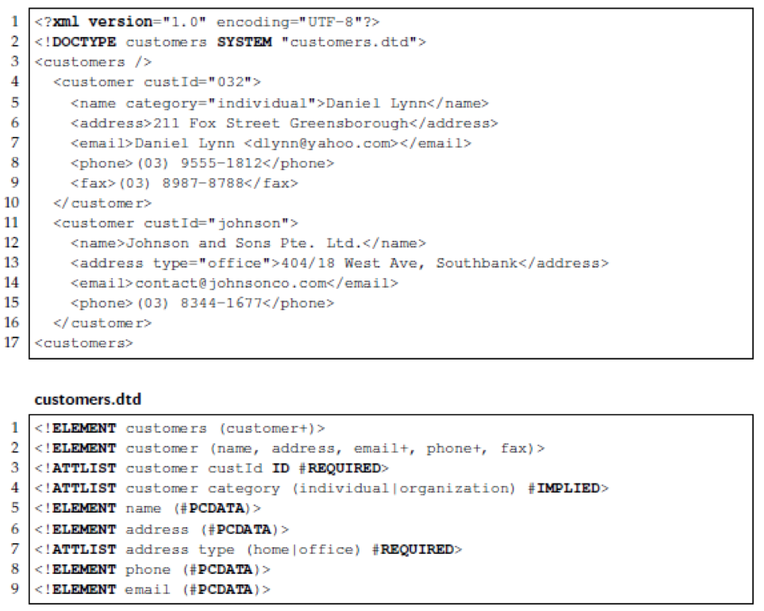

### Examinable things
* Some coding-related questions:
    data processing (aggregation, construction)
    producing HTML: basic tags (headings, table, paragraphs, block, inline)
    Flask app: basic structure, request object, user input

* Data Types
* Character representation: byte string and Unicode string
* Booleans and logic operators
* Functions
* Selection/control
* Iteration/looping
* Lists
* Dictionary/tuples

NOT examinable:
* lxml
* matplotlib
* JSON(Concept needs to know, how to call in javascript!)  


### Review Lecture - Subjects
1. Representing data: XML & JSON
2. Information, Data & Meaning
3. Information in Global World (Languages Unicode) 
4. Mechanics of the Web
5. HTML & CSS
6. Spreadsheet (basic function: Arrayformula, sort...)
7. Visualisation (tools, spreadsheet, javascript, library)
8. Analysis (Ways to get inside the data, simple aggeragation, variables, correlations, numerical measeurs)
9. Interactivity (Javascript)
10. Informatics in Society: Big Data & Security (Real world issue, security)
11. Network of Data (structure of data from network)

## Representing Data

### JSON & XML question:
* differences between the XML and CSV formats
    * flat
    * well-formed, XML->DTD
    * Commas brackets
    * ...
* find mistakes in XML file against DTD
    
    * backslash
    * type
    * <>
    * ......

### Structure of data
* Hierarchy/Tree (XML) 
* Relational/Tabular (database tables) 
* Graph (network)

### XML - Summary
eXtensible Markup Language
* XML adds meaning to the formatting of other markup languages (like HTML)
* XML allows a standard method of data exchange and structural specification
    * Which you can define with a DTD (Document Type Definition)
* XML is verbose冗长的
* XML is a hierarchical method of organising data

### JSON – Summary
* JavaScript Object Notation
* Lightweight, streamlined, standard method of data exchange
* Designed to speed up client/server interactions:
    * By running in the client browser
* Native JavaScript, so can be executed as code
* Lacks context and schema definitions
* Integral to the Big Data paradigm (NoSQL)

### HTML / CSS – two question types
* Look through a file and name the coloured/styled elements
* Given an HTML file, write the CSS file that will give you the shown page (static and dynamically generated)
* Examples on PDF... [sample-html.pdf](resources/553F301647FF5943524453DD302CBFD1.pdf)



### Information Data & Meaning– Practice Questions