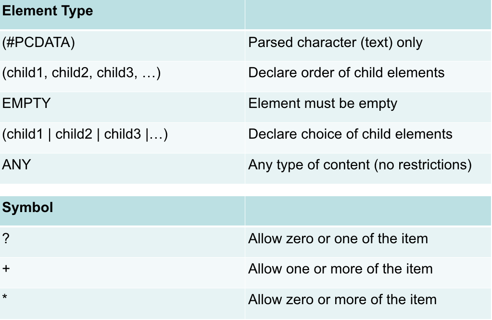
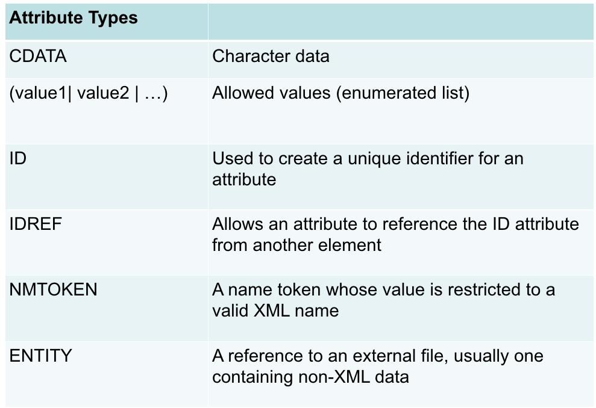
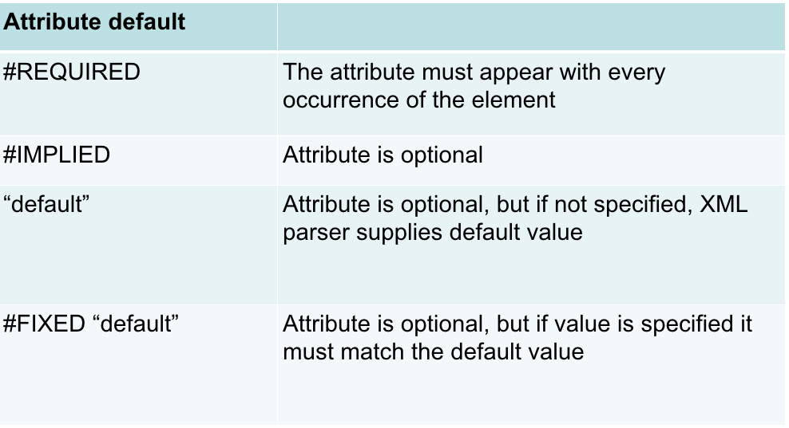

### CSV (Comma Separated Value)
* Spreadsheets/text
* Easier to organize
* Semi-structured (no types of values)
* time series, experimental data...

### Tree Stucture
* Hierarchical, typically self-contained docs

### HTML
* Designed for **pure** presentation
  * Concerned with formatting not **meaning**
  * HTML is not extensible 
  * can’t be modified to meet specific domain knowledge
  * browsers have developed their own tags `<bgsound> & <labyer>`

  * HTML can be inconsistently applied
    * almost everthing is rendered somehow

### XML (eXtensible Markup Language)
* A ‘meta’ mark-up language
  * used to create other mark up languages
  * Extensible, user defined tags
* Separates style and content
* Supports internationalisation (Unicode)
* Rigorous adherence to rules
* Device and system independent
* **Both humans and machines can read it…**

### XML Rules
* XML files must begin with `<?xml version=“1.0”?>`
* XML files must have one single root element `<catalog>...</catalog>`
* elements are built with tags, must be properly closed 
  * opening `<firstname>` and closing `</firstname>`
  * empty `<br />`
* an element may have one or more attributes, attributes must be in quotes 
  * `<person title="Sir">Tony</person>`
  * `<person title="Mr" sex="M">Ivo</person>`
* XML code is case sensitive
  * `<title>` is not the same as as `<Title>`
* elements must be appropriately nested
  * ~~`<author><firstname>James</author> </firstname>`~~
* comments
  * `<!-- comments do not affect the document,
it's not part of the data that you want to represent -->` 

### DTD (Document Type Definition)
* DTD is a schema that creates a **consistent data structure**
* DTD designers must choose
* Attributes cannot contain elements
  * elements can contain other elements
* Attributes have no explicit structure
  * ‘chapter’ cannot be an attribute of ‘book’
* Attributes are used for small, simple, unstructured, “extra”/secondary information
* Attributes can be specified only once and in any order
* Attributes represent properties of objects
* Elements represent parts of objects

#### DTD Elements Rules




### Namespaces
* Namespaces define collections of elements
* Namespace declared as an attribute of element
  * `<customer xmlns:cust="http://mycompany.com/customer">`
    * "cust" is the prefix
      * prefix is any string which is added to elements and attributes to associate them with a particular namespace
    * "http://mycompany.com/customer" is the URI
      * URI (Uniform Resource Identifier) is a string the uniquely identifies the name of the namespace.
* More than one namespaces can be in a single element
* Namespaces normally declared in the root element
  * available for all children of the root

#### URI (Uniform Resource Identifier)
* URIs in namespaces look like a web address
  * They are not!
* The purpose of URI is to be unique identifies
  * URL are often chosen because they tend to 'belong' to the organisation it doesn't necessarily point to a page

### Using XML in Python
* lxml library is your friend…
  * http://lxml.de/
* Import the XML file into your program as a tree structure:

```python
import xml.etree.ElementTree as ET
tree = ET.parse('yourfile.xml') 
root = tree.getroot()
```

`Xixiang Wu Summarized`