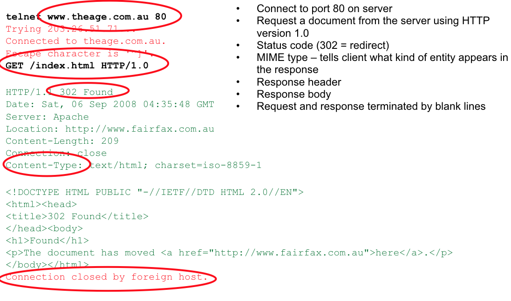

#### Hyper-Text Transfer Protocol (HTTP)
  * How computers talk to each other…

#### HyperText Markup Language (HTML)
  * How this information gets displayed…

#### Flask Web Application Framework
  * How computers process the information…

### HTTP using "telnet"


### HTTP is very simple...
* **GET** - retrieve an entity (document) from the server.
* **POST** - submit data to the server (usually via an HTML form) for processing.
* **PUT** - send an entity to be stored on the server.
* **DELETE** - request the removal of an entity from the server.
* **OPTIONS** - ask the server to reveal its capabilities.
* **HEAD** - same as GET but only return HTTP headers and not the document.

### HyperText Markup Language (HTML)

### Web Application Framework (Flask)
* Encapsulate low-level information passing between browser and application (Python’s server side code)
* Provide routing of the URL
e.g /handler -> taken care by a specific Python code
* Provide templating or abstraction for HTML

#### Flask Hello Wolrd (hello.py)

```python
from flask import Flask
# just serve all the static files under root
app = Flask(__name__, static_folder='.', static_url_path='’)

# for / root, return Hello Word
@app.route("/")
def root():
    return 'Hello World!'

# start listening
if __name__ == "__main__":
    app.run(debug=True)
```

* To launch:
  * python hello.py
  * This will set up a web server that runs on port 5000 `http://localhost:5000/`

* In debug mode, changes on the source code will refresh the web application server

#### Reading user input in python (form.html)

```html
#form.html

<!doctype html>
<html>
<body>
<form method="get" action="handler">
  <p>
    Your name: <input type="text" name="name"/>
     <input type="submit" />
  </p>
</form>
</body>
</html>
```

* Using **GET** or **POST** method

* GET: information is sent as part of the URL `http://localhost:5000/form-handler?input1=A&input2=B`

* POST: information is sent as part of HTTP body/data

After we have the above html file, we could handle this information by using `handler.py`

```python
#handler.py

from flask import Flask, request 
…
@app.route('/handler', methods=['POST', 'GET'])
def handler():
  if request.method == 'POST':
    name = request.form['name']
  else: # GET request method
    name = request.args.get('name’)
```

`Xixiang Wu Summarized`