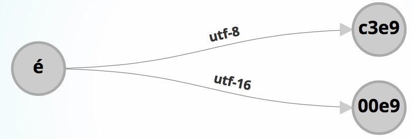
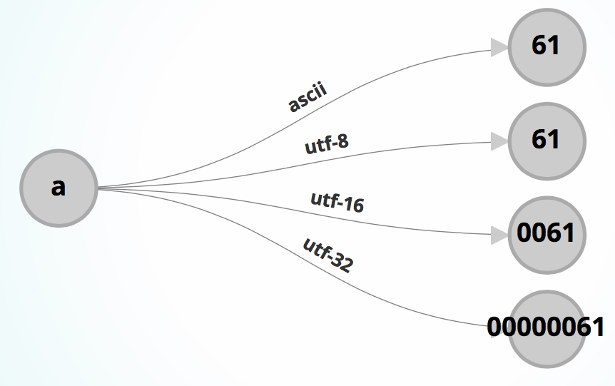

## i18n & L10n
* **localization**
  * modifying or adapting an application to fit the requirements of a particular locale
  * a **_locale_** is a collection of parameters that the defines a specific language, country, script, rules, and coded character set

* **internationalization**
  * designing an application so that it can operate in multiple locales without any engineering change to the application.

### Issues in i18n & L10n
* characters set & encoding
* language translations	
* currency format	
* numerical format	
* date/time format

## character sets
* A character is a indivisible unit of text. A character set defines the range of a character collection.

### ASCII (American Standard Code for Information Interchange)
* Supports Basic Latin characters
* Limited support for European languages
* **é** in **café** is not supported

How can we support other languages?
* Extended Latin charsets (Windows-1252 or ISO-8859-1 (Latin-1))
* Various charsets:
  * Shift-JIS: Japanese
  * Windows-1251: Cyrillic (Russian, Bulgarian, etc.)
  * Big5, GB2312: Chinese
* Problems: overlaps across encodings/representation of these proprietary character sets.

### Unicode 
* Provide a universal character set that encapsulates(概括) almost all characters in the world's languages
* A collection of abstract characters, each identified by an integer/number called code point and unique name (coded character set)
* In Unicode, code point is **NOT** the way computer represents (encodes) the character, but it is used to identify the character

## character encoding
* A character is NOT the physical (binary) representation in a file, in a web page or in a device. A character is an abstract entity, its actual representation is determined by **character encoding**; encoding maps a logical character to a numerical value
* The terms character set and encoding are often used interchangeably (while it is not a problem for ASCII & Windows 1252, it is problematic for Unicode)

* Encoding is a mapping from a logical representation of a character to its physical representation
* Encoding maps a character to (one or more) bytes

### encoding of input and output
* Encoding is needed for interpreting a piece of data: text file, XML file, web page (which are blobs of bytes)
* Programmers need to know the encoding of data that goes into or comes from a device (keyboard, screen, or web browser)

#### How to specify the encoding in HTML page?

```html
<DOCTYPE html>
<html>
  <head>
    <meta http-equiv="content-type" content = "text/html; charset=UTF-8" />
  </head>
</html>
```

### Unicode encoding
* ASCII characters are encoded as **1 byte** (a single way of encoding)
* Unicode uses variable length encoding: 1-4 bytes (multiple ways of encoding: UTF-8, UT-16, UTF-32)


### UTF-8 encoding
* The **most commonly** used encoding is UTF-8
* Backward compatible with **ASCII**; all ASCII data are also **UTF-8** encoded


## Python and Unicode
* Python supports (1) **byte string** and (2) **Unicode string**
* Unicode string starts with **_u_** prefix

```python
>>> e_acute = u'\u00e9' # Unicode string
>>> e_acute.encode('utf-8')
'\xc3\xa9' # byte string
```

* Unicode string is an abstract or logical representation of characters.
* Python byte string is a physical representation.
* Sending to a file, web page, device, you need to encode.

### encoding in Python
To convert Unicode string to byte string use encode(encoding) function:

```python
>>> e_acute = u'\u00e9'
>>> e_acute.encode('utf-8')
'\xc3\xa9'
>>> e.encode('latin-1')
'\xe9'
>>> e.encode('cp1252')
'\xe9'
```

### decoding in Python
To convert byte string to Unicode string use decode(encoding) function:

```python
>>> something = '\xc3\xa9'
>>> print something.decode('utf-8')
é
>>> print something.decode('cp1252')
é
```

### consuming unicode

```python
#demo.1.xml

<?xml version="1.0" encoding="UTF-8"?>
<demo>
  <sentence lang="chinese">我爱你</sentence>
  <sentence lang="kazakh">фыыудa</sentence>
  <sentence lang="iceland">Björk</sentence>
</demo>
```

### consuming utf-8 xml
lxml's etree provides Unicode string where necessary

```python
from lxml import etre
etree = etree.parse( "demo-1.xml" )
root = tree.getroot()
for sentence in root:
  print type(sentence.text) # the type of is <unicode>
```

### producing web page in utf-8

```python
str = '''<html>
<head>
  <meta http-equiv="content-type" content="text/html; charset=UTF-8">
  <title>Unicode demo</title>
</head>
<body>
'''
# specify the web page is in UTF-8,
# so that the browser can interpret correctly
```

## Issue
* Everytime you send a Unicode string to a device, a network, or a disk (e.g. using print or file.write()), the Unicode string needs to be encoded to as byte string. If programmer do not do that explicitly, Python does this for you automatically.
* If no encoding is specified, it uses the default encoding (sometimes ascii).

```python
>>> import sys
>>> sys.getdefaultencoding()
'ascii'
```

* Not all Unicode characters can be encoded in target encoding (e.g. ASCII (0-127))
**Solution**: Explicitly encode using supported encoding (e.g UTF-8).

```python
...
print a_unicode_string.encode('utf-8')
...
```

`Xixiang Wu summarized`