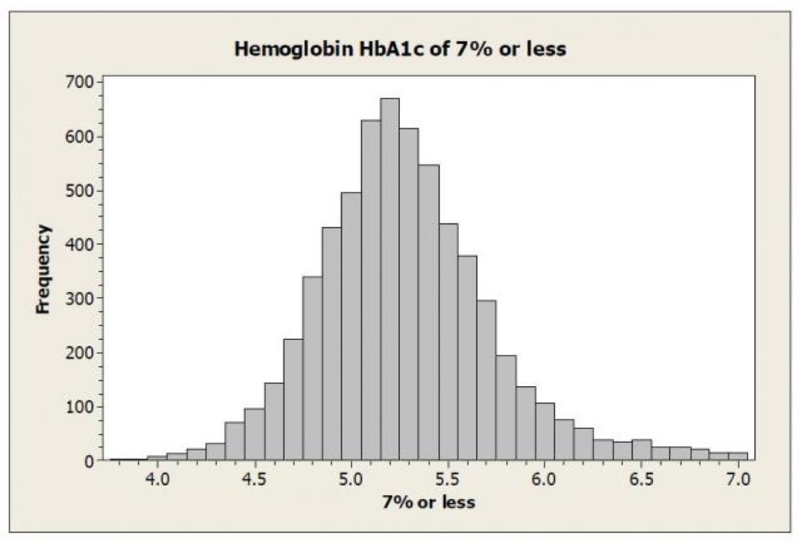
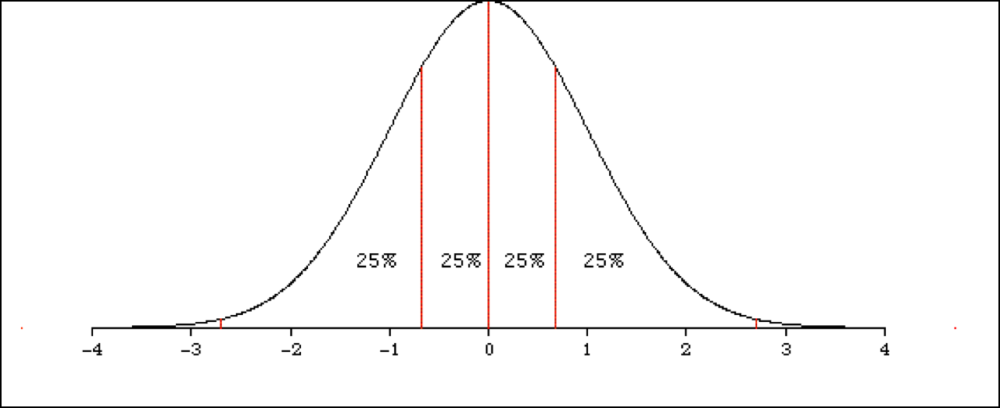
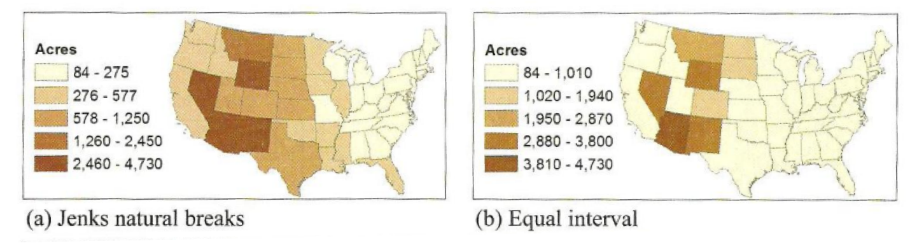
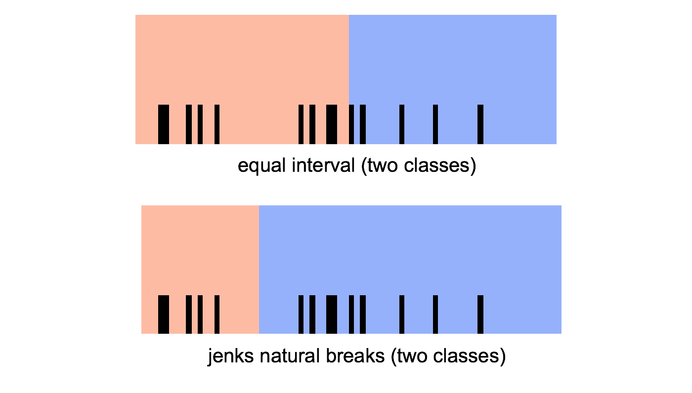
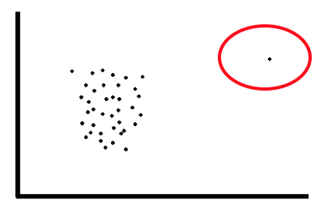

## Analytics
* Discovery and communication of meaningful patterns in data

 

---

## Data analysis – the steps
1. Sourcing
Find your data…
2. Understanding
What do the columns and values represent?
Figure out what story is buried in that data…
3. Cleaning
Are there errors and is the data valid?
What was the original data collection purpose?
4. Transformation
Turn the data into something presentable
5. Feature selection
Pull out the relevant bits to address your hypothesis

 

---

## Data-set types:
Surveys or polls, Experiments, Observational and other studies

## Repository types:
Operational databases, Data warehouses, Historical databases, Purchased data

 

---

# Finding a hypothesis
### Step 1: sourcing data
#### Data types:
* Any kind of persistent file storage (SQL, CSV, XML, JSON, …)
 

### Step 2: understanding the data
Tables
* Data about “things”
* Column is a variable, row is an observation
* Raw or derivative


#### Discrete vs Continuous 分离 vs 连续

Continuous = numbers or anything that can have a range
* Also called “numerical”
> e.g. 
Numerical measurements:
Temperature
Velocity
Time
Etc
Anything that can be set down as a range…

 
Discrete = anything else
* Also called “categorical”
* But note: numbers can be discrete too
> e.g.
Anything that isn’t a number (“nominal”):
Colours
Political party
Favourite food
Car models
Age (as commonly used in polls – e.g. 21-35)
Etc
But **numbers** can also be discrete (“ordinal”):
A set of options (e.g. choose either “1”, “2”, or “3”)

Frequency distribution
* Define categories and plot them along the x-axis

If the variable is already categorical:
* … just use those

If it is numerical:
* … count the instances and put them into the categories (called a histogram)
 

---


## Transforming continuous to discrete
The basic idea:
* Divide the range into intervals that have well-defined boundaries

* Commonly called **“binning” into a histogram** 


 

---

## Defining Intervals
### Equal interval
Intuitively easiest: split up the range equally and see how the data falls into them (previous example)
### Quantile
Instead of splitting up the range, look at the data and break up the categories so that each one has equal member numbers
### Jenks (Natural Breaks)
Look at the data and see where the “natural” intervals lie (by measuring the distance from the mean)

e.g. Quartile graph (normal distribution)


e.g. Jenks (Natural Breaks)
Cluster a set of values into different classes by reducing the variance within classes and maximizing the variance between classes.


e.g. Jenks (Natural Breaks)


### Step 3: cleaning the data
* Validation and tidying of the data

* Semantic similarities:
    * “General Electric Company”
    * “General Elec Co.”
    * “GE”
    * “Gen. Electric Company”

* Range problems (or maybe wrong units…)
    * Age = 150 years
    * Blood pressure = 250 mmHg

#### Removing variables
Removing an entire category because it contributes nothing of interest or relevance 


 
outliers
 
 

---

### Step 4: Transformation
Normalization
* Scale numerical columns so that they can be compared fairly
    * e.g. converting absolute numbers to percentages, then scaling
* Value mapping
    * Convert text data (nominal) to numbers
    * e.g. low = 0, medium = 1, high = 2
* Discretization
    * Convert numerical variables into categorical ones
* Aggregation
    * Derive a variable that isn’t present from two (or more) that are…
 

---
### Step 5: Feature Extraction
* If your data is way too big… then there will probably be some redundancy
    * e.g. measurements in metres and feet

* Feature extraction is an algorithm to pull only the information of relevance => Data Mining

* This is yet another branch of mathematics in itself…
    * Principal component analysis, Non-linear dimensionality reduction, etc.