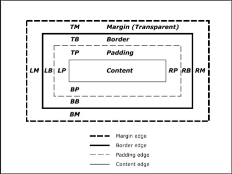

## Cascading Style Sheets (CSS)
* Declarative language for specifying HTML presentation 
* Separates content from presentation 
* Reduces the amount of effort required to style a document or web site

<br />

---
## Three approaches to styling
* Inline - specify **style** attribute on each element
* Embedded - specify styles in the **head** of the document
* Linked or Imported - load styles from one or more external files

<br />

---
## Inline styles
* HTML elements have a variety of propereties that control how they are rendered to the screen
* The **style** attribute can be used to specify the properties of a single element

```HTML
<div>Before!</div>
<div style="border:1px solid red;padding:10px;">After!</div>
```

<br />

---
## Embedded styles
* Specified as rules that tell the browser what styles to apply and to which elements
* Declared in a **style** block inside the document **head**

``` HTML
<!DOCTYPE html> 
    <html> 
        <head> 
            <style>
                h1 { text-align: center } 
            </style> 
        </head> 
    <body>
        <h1>Hello World!</h1> 
    </body>
</html>
```

Rules:
``` CSS
selector { 
    property: value; 
    property: value; 
}
```

<br />

---
## Selectors
* Type, Universal 
* ID 
* Attribute, Class 
* Pseudo-class 
* Adjacent, Child, Descendent

### Type Selector
``` HTML
body { 
    background-color: black; 
    color: white; 
}

div { 
    border: 1px dashed blue; 
    padding: 5px; 
}
```

### Universal Selector
Applies a style to **all** HTML elements.
``` HTML
* {
    font-family: Helvetica, sans-serif;
}
```

### ID Selectors
``` HTML
<div id="summary">...</div>

CSS:
#summary {
    color: blue; 
}

```
### Attribute Selector
``` HTML
<form method="post" action="http://localhost/cgi-bin/contact"> 
    <input type="text" name="name"> 
    <input type="email" name="email"> 
</form>

CSS:
input[type="text"] { 
    background-color:wheat 
}
```

### Class selector
``` HTML
<span class='big'>Big</span> text.

CSS:
span.big { font-size: 1.5em; }
*.big { font-size: 1.5em; }
.big { font-size: 1.5em; }
```

### Pseudo-classes
``` HTML
a:link { color: #ff0000; } /* unvisited link */ 
a:visited { color: #00ff00; } /* visited link */ 
a:hover { color: #ff00ff; } /* mouse over link */ 
a:active { color: #0000ff; } /* selected link

example2:
<a class="red" href="page.html">Link to page</a>
CSS:
a.red:visited { 
    color: #ff0000; 
}
```

### Descendent Selector
``` HTML
selector1 selector2 { 
    property: value 
}
```

### Child Selector
Select the **first** child matching the selector
```HTML
selector1 > selector2 { 
    property: value 
}
```

### Adjacent Selector or Next-sibling Selector
Select the **next** element matching the selector
``` HTML
previousElement + nextElement { property: value; }

img + span.caption { font-style: italic; }
```

<br />

---
CCS Box Model


### Margin & Padding
``` HTML
.spaced { 
    margin: 10px; 
    padding: 5px; 
}
.spaced { 
    margin-top: 10px; 
    padding-left: 5px; 
}

.spaced { 
    margin: 10px 9px 8px 7px;  // top, right, bottom, left:
    padding: 5px 4px 3px 2px;  // top, right, bottom, left:
}
```

<br />

---
## Border
``` HTML
.outline {
    border: 1px solid orange; 
}
.outline {
    border-bottom: 1px dashed orange; 
}
```
<br />

---
## Height & Width
* Specified in either absolute or relative lengths 
* Absolute lengths are specified in pixels (px) 
* Relative lengths are specified as a percentage of the parent element's dimension

<br />

---
## Position
* **Relative** - relative to the top left corner of parent 
* **Absolute** - document coordinate position 
* **Fixed** - screen coordinate position

<br />

---
## Colour
* Named - red, green, blue, ... 
* Hexadecimal value - #10FFA9
* RGB decimal value - rgb(255, 255, 255) 
* RGBA decimal value - rgba(255, 255, 255, 0.5)

<br />

---
## Fonts
``` HTML
body {
    font-family: 'Helvetica Neue', Helvetica, sans-serif; 
}
```

<br />

---
## Generic and Fallbacks
The browser predefines a number of generic fonts: **serif**, **sans-serif**, **monospace**, ...

<br />

---
## Linking Fonts
``` HTML
<link href='https://fonts.googleapis.com/css?family=Raleway' rel='stylesheet' type='text/css'>
```
<br />

---
## Imported Styles
* Styles can be imported from an external file using the **link**
* Styles are applied in the order they are loaded
<br />

---
## Media Queries
```
@media (min-width: 500px) and (max-width: 600px) { 
    h1 {
        color: fuchsia; 
    }

.desc:after {
    content:" In fact, it's between 500px and 600px wide."; 
}
```

<br />

---
## Cascading Styles 层叠式
* HTML elements inherit some or all presentation properties from their parent elements
* The result is that properties 'cascade' down the DOM


<br />

---
Priority of application
* Styles are sorted by importance, origin and specificity
* The most specific selector has the greatest priority
* If two selectors have the same priority, the one defined latest is applied