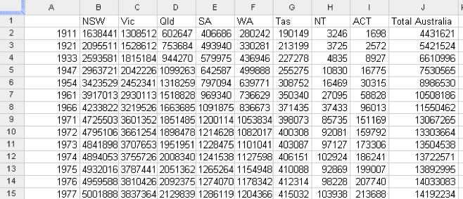
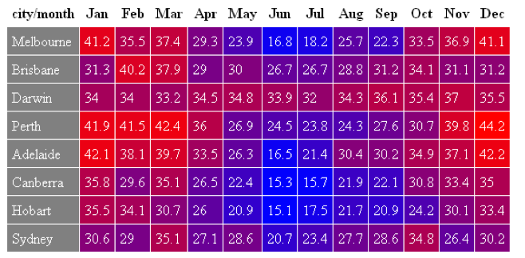
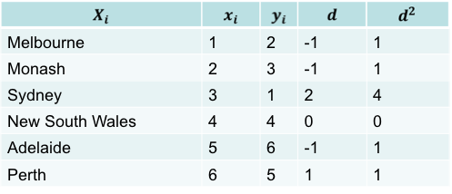
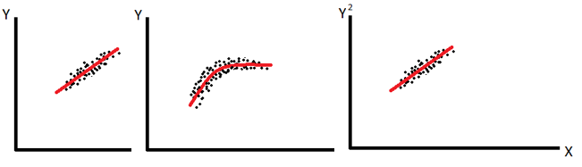
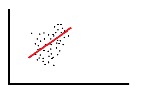
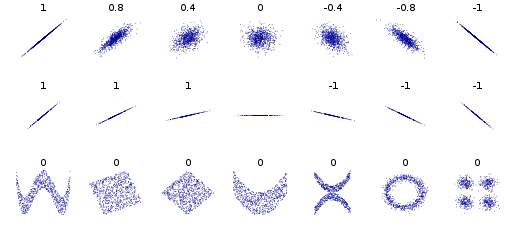

## Overviews
* Visual Analytics vs Numerical Analytics

* Univariate, bivariate, and multivariate

* Simple summarization/aggregation vs more complex statistical analysis

### Birvaritate

* Searching for a relationship between two variables (if one exists)

* Simplest type of statistics. Apart from univariate (= one variable!)

* Covering the basic principles and characteristics of this analysis

### Independent / Dependent variables

* In any experiment you have (at least):
    - one independent variable
    - one dependent variable
    - everything else controlled

    * **For instance**, to establish the effect of temperature on the rate of plant growth:
        - Temperature is the independent variable
        - Growth is the dependent variable
        - Which could be height, weight, number of fruits, etc

### Bivariate analysis of discrete variables: contingency tables

* Summarise information about discrete variables using contingency tables:
    * _“A matrix that shows the frequency distribution of the two variables being correlated”_
    * Also known as a “cross tabulation”
    * Shows the number of observations for each combination of discrete values from two categorical     variables.
    * Categorical values can be ordinal or nominal
    * Continuous values must be made discrete (categorised)


> ### E.g.
#### Contingency table example: population count
YEAR VS STATE
cells are count of resident (total population)
> 


### Pivot table

> ### E.g
#### Pivot tables: visualisation of the contingencies
CITY VS MONTH
cells are average of mean max temperature

* Pivot tables allow quick creation of contingencies

* Can change the order of variables and see the changes (hence “pivot” due to the rotation of the variables)

* Automatically sorts, totals or averages counts within a (tabulated) data-set

### Analysing discrete variables: rank correlation
* Rank correlation
    * Calculates similarities between ranks


### E.g
> 
$d^2 = 8, n = 6$    
$ p = 1 - (6 * 8 ) / (6(36-1))$
* Relatively high value (nearer + 1) suggests yes, there is a relationship

### Bivariate analysis of continuous variables
* Regression
The concept that in the long-term, extreme measurements of a continuous variable will converge on a single “average” relationship

* Pearson correlation coefficient
The degree of relationship between two continuous variables
> ### E.g
> Good Example

> Bad Example


The idea is that there is a defined meaning of “normal” of this data-set, and in a good model the data points are never very far from “normal”
i.e. they “regress to the mean”…

### Linear Regression
For instance, the rate of plant growth is the relationship between the independent and dependent variables:
* Growth = [some number] * Temperature
* Where [some number] is the correlation co-efficient
> ### E.g.


### Pearson correlation coefficient

**
(inverse correlation) -1 <= r <= 1 (positive correlation)
r = 0 (no correlation)
**
