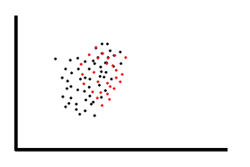
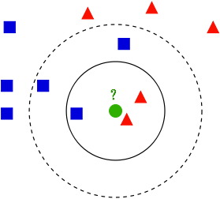

### Data mining
* Data mining, machine learning, statistical learning
    Learning from data 

* Unsupervised (Descriptive) vs 
    Supervised (Unsupervised)

* Supervised Learning: some prior knowledge about what you want to find out (target variable) 

* Exploratory vs Explanatory

#### Data mining - unsupervised
* Provide broader view to get the “data landscape” or “interesting recurrent pattern”

* Association rule
    * Generate rules based on observations of the data-set

* Clustering
    * Groups data into sets of observations or clusters

> ### E.g.
* IF a patient is over 70
    * AND they have history of liver problems
    * AND they have low socio-economic status
        * THEN they are 70% likely to be diabetic

* Advantages:
    * Easy to understand, actionable, good for large data
* Disadvantages:
    * Categorical only, time-consuming to generate, many rules means priority to be worked out

#### Clustering

K-Means Clustering
Advantages: flexible, hierarchical approach possible
Disadvantages: setting initial cluster number, can be slow, size limits

#### Data mining - supervised
* Supervised = using historical patterns to predict what will happen next…

* Class = $f(v1, v2, v3)$

* Regression
    * Mathematical model to predict a continuous response variable

* Classification
    * Allows observations to be assigned to different categories

### Classification

#### KNN Classification
* The class of an unknown instance is the majority of k closest sample/training data.
* Lazy method, the classifier model is the whole dataset.

### Decision Tree
* Classification on discrete values
* Classifier is modelled as a tree. Decision tree grows from the root downwards by selecting the next best attribute at each decision level.