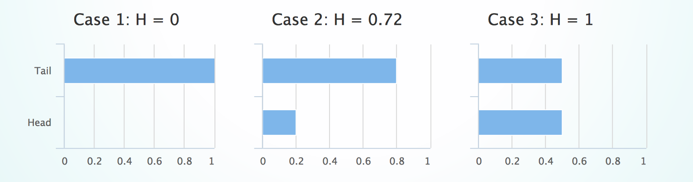
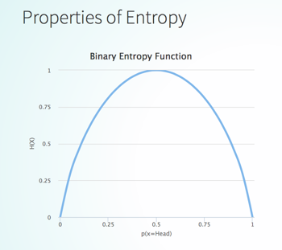
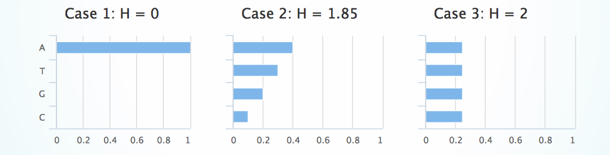

## Data, Information, Knowledge, Wisdom
* Data: know nothing (symbols)
* Information: know what, who, when, where (processed data)
* Knowledge: know how (actionable information)
* Wisdom: know why (evaluated understanding)

## information theory
* Shannon's seminal paper
* Provide a framework to deal with the efficiency of information transmission in noisy channels
* Measure information quantity objectively
* Data as facts
* Devoid of the subjective aspects of information, no semantics and pragmatics.
* Information represents **the degree of freedom in choosing one particular symbol from all possible ones**.
* Bit as the fundamental unit of information.

### Binary Code
* Two-symbol language: two alphabets "0" and "1", binary digits
* Bit is equivalent to the selection between two equally likely choices
* Information quantity depends on the number of alternative message choices encoded in the binary system
* Most economical information encoding (von Baeyer, 2004)

## Measure of Information
### Hartley function (Hartley uncertainty measure)
* Selecting up a particular symbol on a finite set  of uniformly discrete symbols.
* The amount of information needed to remove the uncertainty.
* The amount of uncertainty associated with a set of  alternatives.
* Quantifies how many -choice questions need to be asked to uncover the selected symbol

\begin{align}
{H}_{0}(\mathit{X}) = {log}_{b}|\mathit{X}| = {log}_{b}n
\end{align}

* **b = 2**, the unit of measurement is called shannon (Sh).
* **b = e**, the unit of measurement is called nat (for natural logarithmic).
* **b = 10**, the unit of measurement is called hartley (Hart).

## Entropy of Information
* Shannon's Entropy probabilistic-based measurement
* Information as events (random variable), e.g. tossing coins, receiving a piece of text
* Hartley works for uniformly distributed symbol, Shannon's for non-uniform distribution
* Measure of the amount of uncertainty in selecting a symbol from symbol space
* The more unpredictable a symbol is, the higher its information value

Let:
a message space of symbols in a possible space $\mathit{X}$. Probablistically speaking,$\mathit{X}$ is a discrete random variable with {${x}_{1},...,{x}_{n}$} outcomes .
$p({x}_{i})$ is the probability of selecting 
measure of information content (self-information or surprisal) of symbol ${x}_{i}$ is 
- $logp({x}_{i})$
Entropy of selecting a symbol from  is:

\begin{align}
\textit{H}(\mathit{X}) = -\sum_{i=1}^{n} p({x}_{i}) logp({x}_{i})
\end{align}

## Entropy of a Binary Message
Consider a message, Head or Tail, constructed from the result of tossing a coin

Case 1: Only Heads
$H = -(1 \log_2 1 + 0 \log_2 0) = 0$ bit

Case 2: Biased coin, 80% Heads and 20% Tails
$H = -(0.8 \log_2 0.8 + 0.2 \log_2 0.2) = 0.72$ bit

Case 3: Fair Coin
$H = -(2 \times 0.5 \log_2 0.5) = 1$ bit

## Properties of Entropy

$H$ is maximum when all $p(x_i)$ are equal.
$H$ is minimum when any of $p(x_i)$ is 1.

### Example with 4 symbols
Consider a message space of A, T, G, C characters with various probability distributions.

Case 1: $H = -(1 \log_2 1 + 3 \times 0 \log_2 0) = 0$
Case 2: $H = -(0.4 \log_2 0.4 + 0.3 \log_2 0.3 + 0.2 \log_2 0.2 + 0.1 \log_2 0.1) = 1.85$
Case 3: $H = -(4 \times \frac{1}{4} \log_2 \frac{1}{4}) = 2$

$H$ indicates the theoretical bounds for the average bits needed to represent/compress the symbols. Consider a message constructed from A, T, G, C with distibution of $[0.4,0.3,0.2,0.1]$

· Binary encode A as 00, T as 01, G as 10, and C as 11 (fixed-length)
· Average message length = $(0.4 \times 2 + 0.3 \times 2 + 0.2 \times 2 + 0.1 \times 2) = 2$

Alternatively:
· Binary encode A as 0, T as 10, G as 110, and C as 111 (variable-length)
· Average message length = $(0.4 \times 1 + 0.3 \times 2 + 0.2 \times 3 + 0.1 \times 3) = 1.9 > H = 1.85$
· Using variable-length encoding (in this case Huffman coding), the size is 5% smaller

## information in context
* Data as signals (Shannon's Information) ignores the meaning of its content
* Information in context considers observers (subject) and what the information means to them
* Information as a relationship between the subjective and the objective
* As information is shared, information is also a form of communication.

### information as signs
* Within communication, information acts as a language
* Information as a system of signs
* Semiotics: study of meaning making, formal doctrine of signs (Peirce)
* It includes:
  * _**Syntactics**_: formal structures of signs, grammar/rules of signs construction and relation.
  * _**Semantics**_: relation between signs and objects (the things to which they refer) in the mind of the observers.
  * _**Pragmatics**_: relation between signs and their context (of the observers that interact with the things).

### Peirce's typology of signs
Three forms of "representations" in the sign systems:

* _**Icons**_: 
  * "Likenesses": direct, similar representations of objects, shared quality.
  * Road signs, computer icons
* _**Indices**_: 
  * "Correspondence in fact": indirect representations of objects.
* _**Symbols**_:
  * "Imputed character": arbitrary representations of objects
  * A social convention should be established to understand the representation

### application in informatics/computing/information systems
* developer as the designer of software
semiotics to understand who the users (agent) are, what they need (object), and their relation with their needs
* _human computer interaction_
software as a collection of signs: understanding of data and actions (icons, vocabularies)
user interface design
* _information systems quality_
semiotic understanding of information quality
* _requirement analysis_
pragmatic understanding of the implication of information systems in organisation