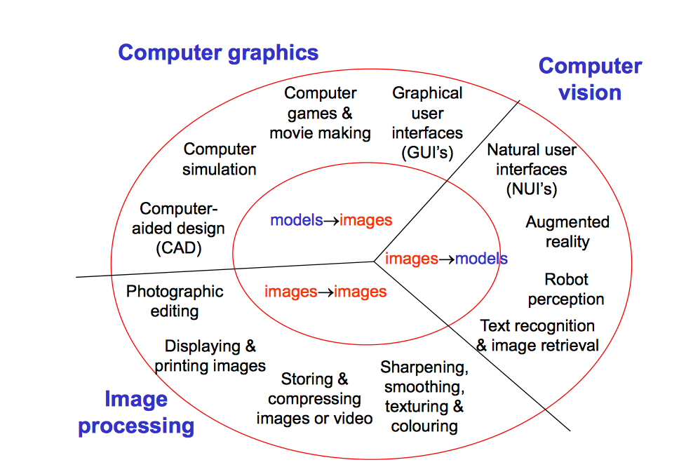

## Aim of COMP30019 Graphics And Interaction

* **encode customised shaders for geometric and lighting models** for displaying realistic objects and animated scenes in real-time,

* **apply efficient algorithms** for computer graphics, augmented reality and (potentially) robotics applications, and

* **design and implement** interactive 3D **Apps**

 

---

## Syllabus
Topics covered will include

* 2-D and 3-D **analytic geometry** for graphics
* representation of **3-D** objects
* computational techniques for realistic graphic **rendering** via programmable **shading langauges** and
* techniques for **interactive** system development.

 

---

## Graphics and interaction: theory and practice

 

---

## Exercise: an image question.

**3D images**:
Space-Space-Space
Space-Space-Time

**2D images**:

**1D images**:
indexing by time, vector in 3 dimensions

**0D images**:
variable