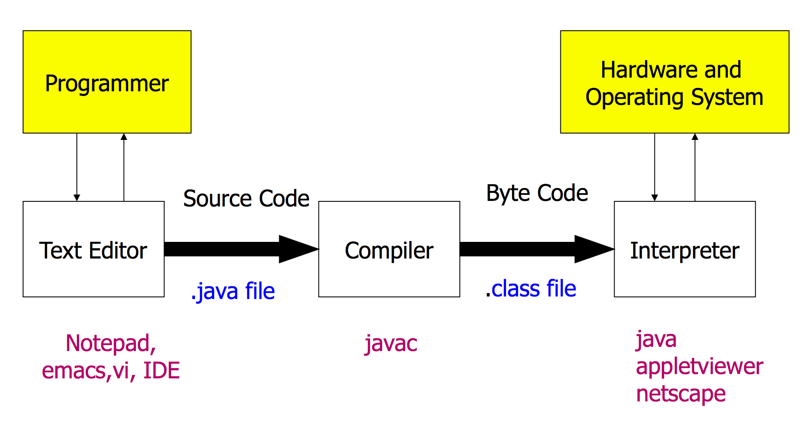
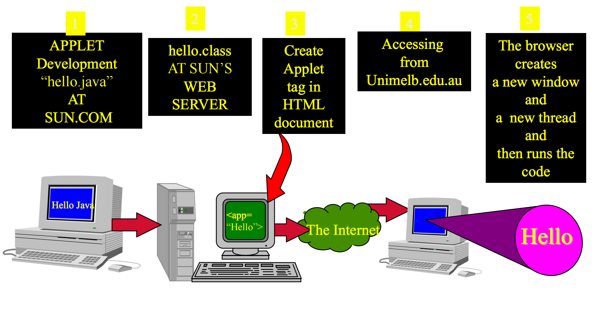

### Introduction to Object Oriented Software Development

Building Software Systems require skills beyond
programming
* Design, analysis

---

### Java: History

A programming language developed by Sun Microsystems -
the project started in 1991 by a team led by James Gosling

---

### Java: Key feature

#### Compiled and Interpreted


Java Compiler:
* Converts: Java source code -> **bytecode**
* Converts: .java -> .class

The **interpreter** will figure out the equivalent machine
dependent code to run

#### Platform-Independent and Portable
Java Integrates Power of Compiled Languages and Flexibility of Interpreted Languages

#### Object-Oriented

* Java is an **OOP**(Object Oriented Programming) language

* **Object**: It interacts with one another by means of actions
* **Class**: Objects of the same kind have the same **type**(Class)
* **Method**: The actions which can be performed within an object.

---

### Applications vs Applets

#### Application:
- Is a stand-alone program.
- Has a “main” method.
- Can be invoked from command line using the Java interpreter

#### Applet:
- A program embedded in a web page.
- Has no main method.
- Can be be run by a Java enabled web browser.

---

### Java supports 3 types of comments
* `/* */ ` - Usually used from multi-line comments. Similar to C.
* `//` - Used for single line comments.
* `/** */` - Documentation comments.

---

### Hello World
#### import
`import java.lang.*;`
* `import` is same as `#include`
* used to import addtional **classes**
* Classes are grouped into a **package**
* Packages may be defined by different people or companies:
  * `ibm.mathlib.*`            // maths lib dev by ibm
  * `microsoft.mathlib.*`      // maths lib dev by ms

NOT: `println()` is in `java.lang.*`

#### main method
- A class can have only one main() method

#### Obejects
- **Objects** are used for performing actions
- Actions performed by Objects are called **Methods**

> e.g.
`System.out.println("Hello, World!");`
- `System.out` is an **object** that prints output to the screen.
- `println` is the **method** that performs the requested action.
- `Hello World!` is an **argument** to the method.

- **Performing an action** on an object is also called
  - Invoking the method
  - Calling the method
  - Sending a message to the object

---

### Program Processing
#### Command Line Option
java -> javac -> result

#### Command Line Arguements
`java HelloWorld Australia England France`
- `java` call java compiler in command line
- `HelloWorld` class name
- `Australia England France` command line arguments to the program
   - Australia ----> args[0]
   - England ----> args[1]
   - France ----> args[2]

---
### Execution of Applets


``` java
//HelloInternet.java Applet
import java.applet.Applet;
import java.awt.*;
public class HelloInternet extends Applet {
  public void paint(Graphics g) {
    g.drawString (“Hello Internet !”,25, 25);
  }
}
```
