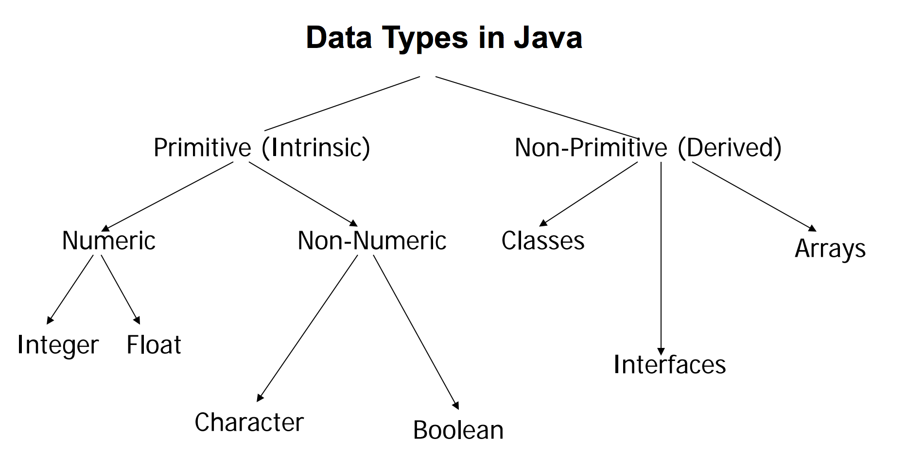
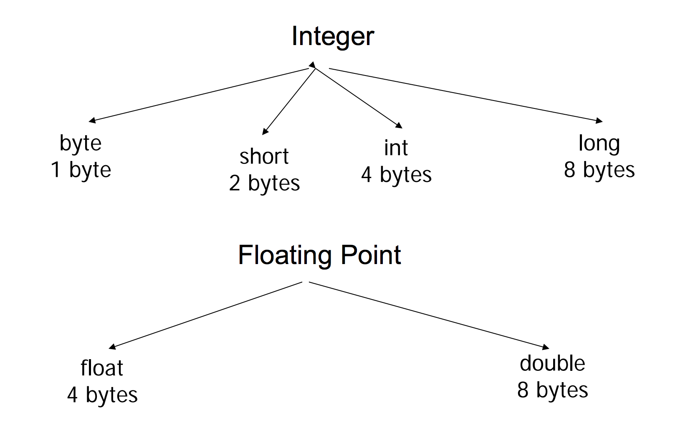
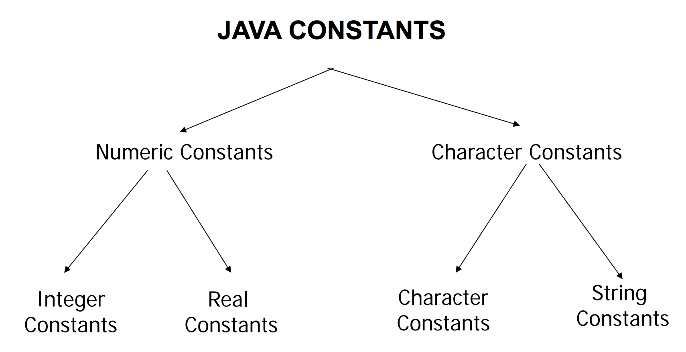
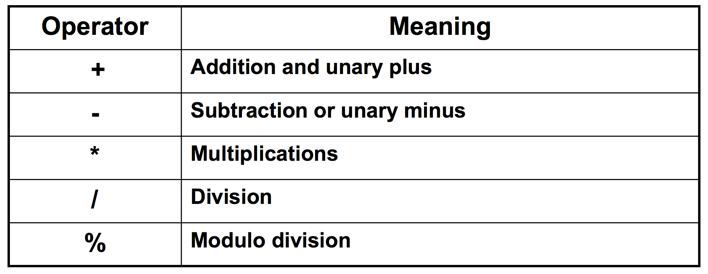
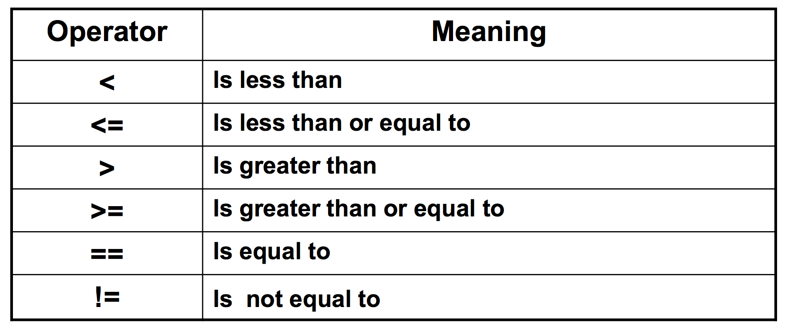
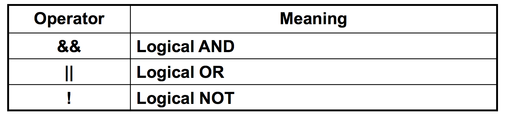
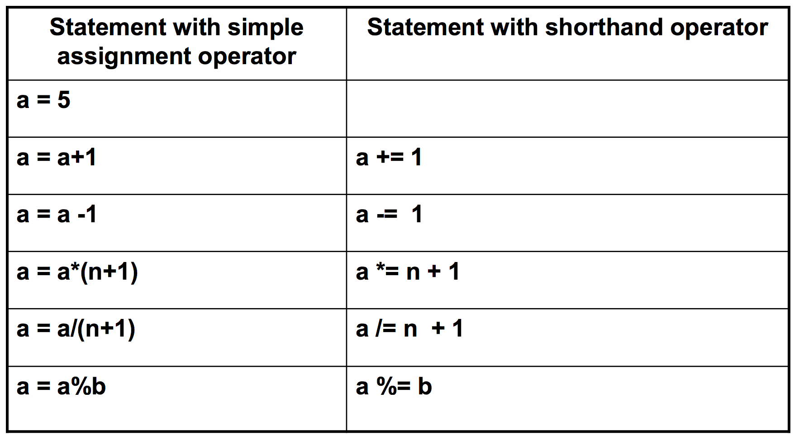
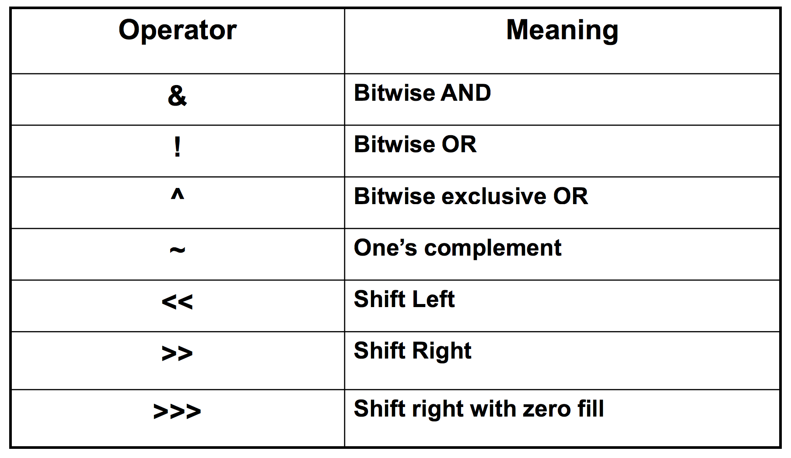

### Identifier
A name that uniquely identifies a program element such as a class,
object, variable, method

##### Rules
- **must not start with a digit**
- all the characters must be **letters**, **digits**, or the **underscore** symbol
- can theoretically be of any length;
- are case-sensitive: Rate, rate, and RATE are the names of three different variables

##### Conventions
- variables, methods, and objects
  1. identifiers start with a **lowercase** letter
  2. indicate "word" boundaries with an **uppercase** letter
  3.  restrict the remaining characters to **digits** and **lowercase** letters
  ```
  e. g. topSpeed,bankRate1,timeOfArrival
  ```

- classes
  - Start with an **uppercase** letter and, otherwise, adhere to the rules above
      e.g. PrintDemo, HelloWorld

---

### Keywords and Reserved words
```
e.g. public, class, void, static
```

### Predefined identifiers
```
e.g. System, String, println

```
Dont ever touch them!

---

### Variables
- Variables must be **declared** before use
``` java
e.g. int x;
```

- Initial value can be set by **initialization** expressions
``` java
e.g. int x = 1;
```

- Variables can be defined just before their usage
``` java
e.g. for( int i = 0; i < 10; i++ )
```

#### Variable Types


#### Integer and Float Types


#### Notes on Variable Types
- Floating point numbers :
  - float type has single-precision.
  - double type has double-precision.
  - Generally, floating point numbers are treated as double-precision numbers. To force them to be in single precision we must append f or F to the number.
``` java
float a = 2.3F;
double b = 6.7;
```

#### Boolean Numbers :
Java supports boolean type variables which can hold a true or
false;
``` java
boolean x = true;
```

#### Variable Initialization
A variable that has been declared but that has not yet been
given a value by some means is said to be **uninitialized**

#### Shorthand Assignment Statements
```
+=
-+
*=
/=
%=
```

#### Variable Assignment
``` java
int intVariable = 2.99; //Illegal
```

exception
``` java
double doubleVariable = 2;
```

#### Assignment Compatibility


**NOT:** **Boolean** and **int** cannot be transfered either way in java

#### Constants
- **Read Only** variable
```
final int MAX_LENGTH = 420;
final double PI = 3.1428;
```



- char: in single quote
- strings of chars: in double quote

#### scope of variables
- Java variables are classified into 3 categories
  - **instance** variables
  - **class** variables
  - **local** variables
    - Variables defined within a block of code, as in the example are called local variables.


#### Operators
- Arithmetic operators
- Relational operators
- Logical operators
- Assignment operators
- Increment and decrement operators
- Conditional operators
- Bitwise operators
- Special operators

###### Arithmetic Operators


##### Relational Operators


**NOTE** The result of a relational operator is type **boolean**.

##### Logical Operators


##### Assignment Operators


##### Bitwise Operators


##### Increment and decrement operators
``` java
++x;
--x;
```

##### Conditional Operators
``` java
x = (a > b) ? a : b

if (a > b) {
  x = a;
} else {
  x = b;
}
```
#### Mathematical Functions
```java
e.g.

double y, z;
y = Math.sqrt(x);
z = Math.cos(y);
```

#### Arithmetic Operators and Expressions
If different types are combined in an expression, then the resulting type is the right-most type on the following list that is found within the expression


**NOT** Exception: If the type produced should be byte or short (according to the rules above), then the type produced will actually be an int

#### Parentheses and Precedence Rules
- Unary operators of equal precedence are grouped right-to-left
```
+-+rate is evaluated as +(-(+rate))
```
- Binary operators of equal precedence are grouped left-to-right
```
base + rate + hours is evaluated as (base + rate) + hours
```
- Exception: A string of assignment operators is grouped right-to-left
```
n1 = n2 = n3; is evaluated as n1 = (n2 = n3);
```

#### Pitfall: Round-Off Errors in Floating-Point Numbers
- A computer has a finite amount of storage space
  - It may store 1.0/3.0 as something like 0.3333333333, which is slightly smaller than one-third
- floating-point numbers may lose accuracy

#### Integer and Floating-Point Division
- When one or both operands are a floating-point type, division results in a floating-point type
  -  `15.0/2` evaluates to `7.5`
- When both operands are integer types, division results in an integer type
  - Any fractional part is discarded
  - The number is not rounded
    - `15/2` evaluates to `7`

**NOT** Be careful to make at least one of the operands a floatingpoint type if the fractional portion is needed

#### The % Operator
- The % operator for operands of type double/float – **don’t use it**

#### Type Casting
- A type cast takes a value of one type and produces a value of another type with an "**equivalent**" value
```java
double ans = n / (double)m;
```
- When type casting from a floating-point to an integer type, the number is **truncated**, not **rounded**
  - `(int)2.9` evaluates to `2`, not `3`
- When the value of an integer type is assigned to a variable of a floating-point type, Java performs an automatic type cast called a **type coercion**
  - `double d = 5;`

#### Increment and Decrement Operators
- When either operator precedes its variable, and is part of an expression, then the expression is evaluated using the **changed** value of the variable
  - If `n` is equal to `2`, then `2*(++n)` evaluates to `6`
- When either operator follows its variable, and is part of an expression, then the expression is evaluated using the original value of the variable, and only then is the variable value changed
  - If `n` is equal to `2`, then `2*(n++)` evaluates to `4`

#### The String Class
